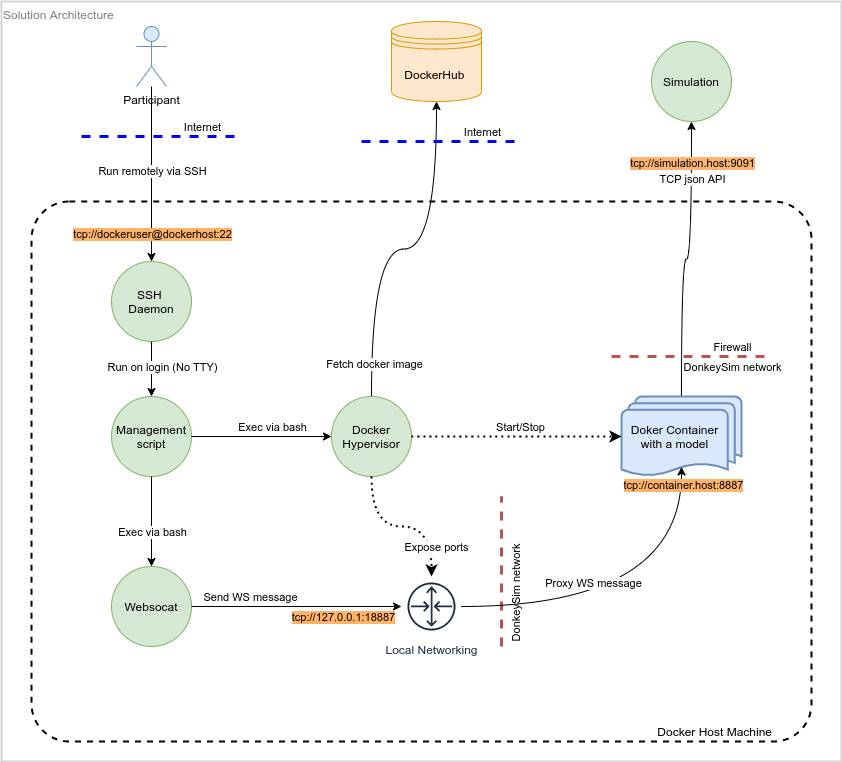

# Objectives

1. To run and stop a docker container via ssh -T command in restricted mode, available for participants
2. To change the driving mode from `user` to `local` (and back) for the DonkeyCar compatible frameworks via ssh, available for participants
3. To resrtict the access for the containers to only the Simulation

# Functional requirements

Parameters contolled by participants

* A docker image tag: `eg: "v2"`  
* A command to run in a container:  
    ```
    eg: "cd /root/myrace/ && python3 /root/myrace/manage.py drive --model /root/myrace/models/mypilot_circuit_launch_19.h5 --myconfig=myconfig-trnm-local.py"
    ```  
* A command to do an action on a container: `eg: "start_container|stop_container|change_drive_mode"`

Parameters contolled by an administrator

+ A local port for mapping host's tcp port to container's `tcp/8887` port
+ A docker image name: `eg: "altexdim/donkeycar_race2"`
+ A docker container name: `eg: "donkeysim_altex"`
   
Example of the command which will be executed on a docker host machine in result for a participant:
```
docker run --rm --network=donkeysim -p "127.0.0.1:$admin_defined_port:8887" "$user_docker_image:$image_tag" bash -c "$user_command"
```

# Non-functional requirements

* No internet access from the containers.
* The only IP address which is allowed to access from the Docker container is the Simulation address
* No shell access for participants on the docker host machine
* Restricted number of pre-defined commands is available for participants to run on the docker host
* No builds of docker containers is allowed for participants. All the docker images should be pre-build and uploaded to the DockerHub.

# Solution overview



# Step by step installation guide for an administrator
    
- [ ] Add a local linux user on the docker host machine.
  Note that it's needed only one local linux user to run all the participans' containers.
  There's no need to add as many local linux users as the number of participants.
  - `dockeruser` is used in the examples throughout this document as the user name of the local linux user. 
  - `dockerhost` is used as a reference to the docker host machine in this document.
- [ ] (Optional) It would be also a wise idea to disable login by password (so the only option for the authentication is a public key) in `/etc/sshd/sshd.conf`, and to change the SSH port from
  the default `22` to something random like `28974`.
- [ ] Add a local linux user to the docker group to be able to run docker commands from that user.
  ``` 
  # "dockeruser" - is the local linux user on the "dockerhost" host
  sudo usermod -aG docker dockeruser
  ```
- [ ] Create the SSH authentication file for that user
  ``` 
  mkdir /home/dockeruser/.ssh/
  chmod 600 /home/dockeruser/.ssh/
  touch /home/dockeruser/.ssh/authorized_keys
  chmod 600 /home/dockeruser/.ssh/authorized_keys
  ```
- [ ] Create a folder for logs
  ```
  mkdir /home/dockeruser/logs/
  ```
- [ ] Put the file `src/bin/donkeysim-race.sh` from this repository to the `~/bin` folder in the `dockeruser`'s home directory, and make it executable 
  ```
  mkdir /home/dockeruser/bin/
  # git clone {this_repo}  
  # cp {this_repo}/src/bin/donkeysim-race.sh /home/dockeruser/bin/donkeysim-race.sh
  chmod +x /home/dockeruser/bin/donkeysim-race.sh
  ```
- [ ] Add a user-defined bridge network called `donkeysim` for the docker
  ```
  docker network create donkeysim
  ```
- [ ] Inspect the `donkeysim` network for IP address and network mask
  ```
  docker network inspect donkeysim | grep Subnet
  # Output: "Subnet": "172.18.0.0/16",
  ```
- [ ] Add the firewall rules for the docker network
    ```
    # Sim ip: 93.184.216.34 - is just an example here, this is supposed to be the Simulator ip address
    # Donkeysim net: 172.18.0.0/16 - this is our donkeysim network
    iptables -I DOCKER-USER 1 -s 93.184.216.34/32 -d 172.18.0.0/16 -j RETURN
    iptables -I DOCKER-USER 2 -s 172.18.0.0/16 -d 93.184.216.34/32 -j RETURN
    iptables -I DOCKER-USER 3 -s 172.18.0.0/16 -d 172.18.0.0/16 -j RETURN
    iptables -I DOCKER-USER 4 -s 172.18.0.0/16 -j REJECT --reject-with icmp-port-unreachable
    iptables -I DOCKER-USER 5 -d 172.18.0.0/16 -j REJECT --reject-with icmp-port-unreachable
    iptables -I DOCKER-USER 6 -j RETURN
    ```
- [ ] Save the firewall rules
    ```
    mkdir /etc/iptables/
    iptables-save > /etc/iptables/rules.v4
    ```
    Note that on Ubuntu it's needed to install the additional packege to restore the firewall rules on stratup
    ```
    sudo apt-get install iptables-persistent
    ```
- [ ] Install `websocat` command line WebSocket client. It's needed to start/stop a car.
  - https://github.com/vi/websocat/releases is the official repository
  - For instance, `websocat_1.8.0_newer_amd64.deb` is
  the package for the Ubuntu 64 bit.

# Step by step guide for adding a new participant for an administrator

- [ ] Request all the necessary information from the participant
  - the SSH public key 
  - the docker image name from the dockerhub (pre-build container images are stored there)
- [ ] Add the participant to the SSH authentication file
    ```
    # Open file in the editor:
    vim /home/dockeruser/.ssh/authorized_keys
    # Add the following line:
    command="/home/dockeruser/bin/donkeysim-race.sh -p 18887 -i altexdim/donkeycar_race2 -n donkeysim_altex",restrict ssh-ed25519 AAAA<...ssh public key continues here...>
    ```
  In this example:
  - `18887` is the local tcp port on the `dockerhost` to be able to change drive mode. Just use any free port. Should be different for each participant. Should be chosen by the administator. Will be exposed on the `dockerhost` machine on the `127.0.0.1` address.
  - `altexdim/donkeycar_race2` is the example of the image name provided from the participant. Should be unique for each participant.
  - `donkeysim_altex` is the container name to refer to using docker command. You can choose any name you like for this particular participant. This will be used to start and stop the container. This will also restrict the usage of this container to only one instance at a time. Should be unique for each participant.
  - `restrict` pay extra attention to that argument, it's required to disallow shell access to the `dockerhost` for the `dockeruser` user via ssh. This blocks any `tty` allocation for that user via SSH.
  - `/home/dockeruser/bin/donkeysim-race.sh` is our management script from the current repository

# Step by step guide for removing a participant for an administrator

- [ ] Remove the participant's SSH public key from the SSH authentication file
    ```
    # Open the editor:
    vim /home/dockeruser/.ssh/authorized_keys
    # Remove the following line:
    command="...",restrict ssh-ed25519 AAAA...
    ```

# Step by step guide for a participant to set everything up before the race

  - [ ] Prepare your SSH public key to access the `dockerhost` machine to manage you container
    ```
    # Generate a key pair
    ssh-keygen -t ed25519 -C "your_email@example.com" -f /home/myusername/.ssh/donkeysim_race
    # Check it's there
    ls -la /home/myusername/.ssh/donkeysim_race*
    # Output:
    # -rw------- 1 myusername myusername 464 Aug 22 23:18 /home/myusername/.ssh/donkeysim_race
    # -rw-r--r-- 1 myusername myusername 104 Aug 22 23:18 /home/myusername/.ssh/donkeysim_race.pub
    ```
    
    Where: 
    - `your_email@example.com` is your personal email address
    - `myusername` is your local username on your PC
    - `/home/myusername/.ssh/donkeysim_race` is your secure SSH private key. 🔥🔥🔥 **Don't share it with anyone!** 🔥🔥🔥
    - `/home/myusername/.ssh/donkeysim_race.pub` is your open SSH public key
    > The `ssh-keygen` command will ask for password. Note that you can add any password you want to encrypt the file. You can also amit the password creation - this is fine for the purpose of the task, but only if noone else can access it. That said, if you use your own PC - keep it simple and don't use extra password for the key; if you share the PC with anyone you don't trust - protect the key with a password.
    
  - [ ] Kindly ask the administrator to add your SSH public key to the system
    - Provide the following details
      - The content of your SSH public key: `/home/myusername/.ssh/donkeysim_race.pub`
      - Your docker container image name on the DockerHub: `myusername/donkeysim_race`
  - [ ] Kindly ask the administrator to provide you the username, the hostname, and the port to connect to. 
    You'll be provided with:
    - `dockeruser` is the username to use for SSH command
    - `dockerhost` is the docker host domain name or ip address for the SSH command 
    - `dockerport` is the port number for the SSH access
    - Test that it's working: `ssh -T dockeruser@dockerhost -p dockerport`. You should see the usage example in the console. You'll see something like that: ```    - Test that it's working: `ssh -T dockeruser@dockerhost -p dockerport`. You should see the usage example in the console. You'll see something like that: ```
    ```
    Usage: ssh -T user@host -- -c <start_container|stop_container|change_drive_mode> [-t IMAGE_TAG] [-r '"RUN_COMMAND"'] [-m <user|local|local_angle>]
    ```
  - [ ] Kindly ask the administrator to provide you with the hostname or IP address of the Simulation, as well as the port number
    - Example: `simulation.host:9091`
    - Where:
      - `simulation.host` is the hostname or IP address of the Simulation
      - `9091` is the port number of the Simulation. 
    
    You suppose to use this IP address to connect to the Simulation environment.
  - [ ] Upload your docker container to the DockerHub, and remember your tag for the image you want to use.
    Use https://github.com/connected-autonomous-mobility/diyrobocar_docker_agent_pln as a general guidance on how to build you own docker container for the DonkeyCar framework and to upload your docker image.
    - Also keep in mind the address of the Simulation (ie `simulation.host:9091`). Make sure you set in correctly in your config files before building the container locally and before uploading it to the DockerHub.
    - Also keep in mind that you don't have to activate autostart for you model if you provide the DonkeyCar compatible WebSocket API exposed in you container on the `tcp/8887` port. You'll be able to use a separate SSH command to start you car.
      > Usually it's recommended to use auto start for the car model which is running in the docker container, so when the container starts the car is also begins to drive automaticaly. But in this case we don't need that so the car should be configured without auto start. To start the car you'll use another command:
      > ```
      > ssh -T dockeruser@dockerhost -p 22 -- -c change_drive_mode -m local
      > ```
      > See more details below.

# How to race guide for a participant

  - [ ] To start the container use the following command:

    ```
    ssh -T dockeruser@dockerhost -p 22 -- -c start_container -t v2 -r '"cd /root/myrace/ && python3 /root/myrace/manage.py drive --model /root/myrace/models/mypilot_circuit_launch_19.h5 --myconfig=myconfig-trnm-local.py"'
    ```
    Where:
    - `dockeruser` is the docker user provided by the administrator
    - `dockerhost` is the docker host domain name or IP address provided by the administrator
    - `22` is the SSH port number provided by the administrator
    - `v2` is the Docker Image Tag which you created when uploaded the docker image to the DockerHub
    - `cd /root/myrace/ && python3 /root/myrace/manage.py drive --model /root/myrace/models/mypilot_circuit_launch_19.h5 --myconfig=myconfig-trnm-local.py` is the example of the command you use inside you docker container to launch a model.
    - Keep in mind double quotes `-r '"<run_command>"'` - they are required. It's also not allowed to use any quotes inside the `run_command` otherwise it could fail to run.
    - Keep in mind that starting a docker container should not start a car automaticaly as we provide a separate SSH command to start a car.

  - [ ] After the race you have to stop your container as soon as possible. Prepare this command in advance in a separate linux console for easy access.

    ```
    ssh -T dockeruser@dockerhost -p 22 -- -c stop_container
    ```

  - [ ] When you hear "Ready, set, go!" you can run your car with that command

    ```
    ssh -T dockeruser@dockerhost -p 22 -- -c change_drive_mode -m local
    ```

    What it will do is 
    - It will send the following message
      ```
      {"angle":0,"throttle":0,"drive_mode":"local","recording":false}'
      ```
      to your container's `tcp/8887` port via WebSocket protocol
      using the URL `ws://127.0.0.1:8887/wsDrive`
    - As a reaction to that WebSocket message your car will start moving (if you are using the DonkeyCar framework, or if you implemented your WebSocket server on the `tcp/8887` port of your docker container)

  - [ ] (Optional) To stop you car you can use the following command. It's optional because your car will be stopped automatically if you stop the container.

    ```
    ssh -T dockeruser@dockerhost -p 22 -- -c change_drive_mode -m local_angle
    ```
    or
    ```
    ssh -T dockeruser@dockerhost -p 22 -- -c change_drive_mode -m user
    ```
    
    It will send the following message
      ```
      {"angle":0,"throttle":0,"drive_mode":"local_angle","recording":false}'
      ```
      or
      ```
      {"angle":0,"throttle":0,"drive_mode":"user","recording":false}'
      ```
      to your container's `tcp/8887` port via WebSocket protocol
      using the URL `ws://127.0.0.1:8887/wsDrive`

# Troubleshooting

1. If a container doesn't see ```host.docker.internal``` host, then add ```--add-host=host.docker.internal:host-gateway``` to the docker run command
